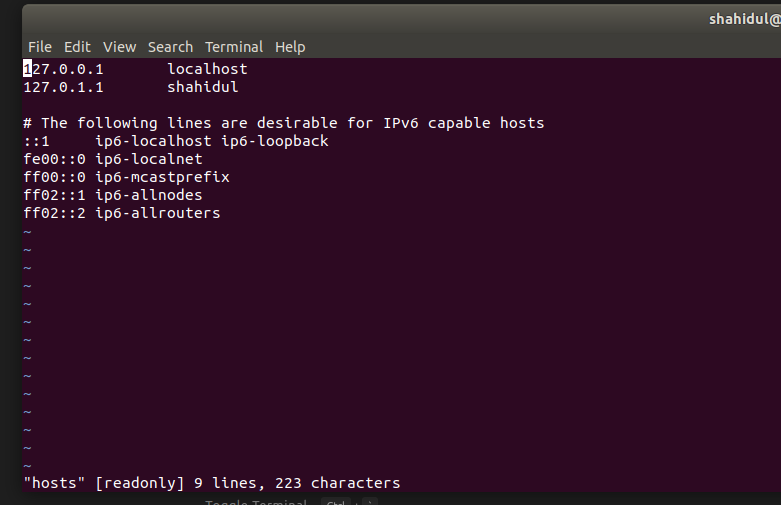
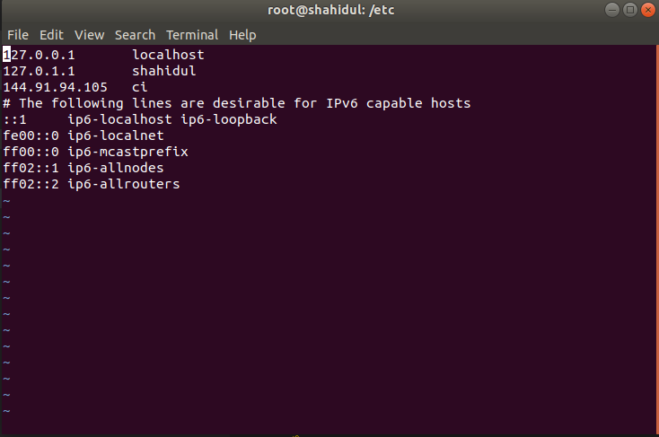

# ansible

``` Ansible uses ssh client to perform jobs to the nodes. Ansible is agent less. That is why ansible needs to installed on the controll machine only. But for some of module python is needed to be install on the remote machines.```

Install ```Ansible``` on ```ubuntu```

```
sudo apt-add-repository ppa:ansible/ansible
sudo apt update
sudo apt install ansible
```

To check if ansible installed successfully,

```
ansible localhost -m ping
```


Output will be something loke following,

```
localhost | SUCCESS => {
    "changed": false, 
    "ping": "pong"
}
```


## Configuring ansible

Our ansible controll machine must have the privileges to log in to the nodes and have the sudo privileges. We don't want to remember the IP address of the nodes as this is very difficult. So what we can do, we can provide a domain name to the nodes. To do this, we need to edit hosts file of our controll machine.

``` 
vi /ect/hosts

```
```hosts``` file contains contents like following,



Add server as following,



Now check if you can poing ci

``` ping ci ```


Now generate a ssh key pair in controll machine. a public and a private key will be generated. Public key wil be distributed to the nodes.

```Note:``` Do not distribute your private key.

Let's generate a ssh key pair.

``` ssh-keygen```
Press ```ENTER``` several times. ssh key parin will be generated.
To check if ssh key has been generated,

Go to your users directory,

``` ls .ssh```
You'll see two files named, ```id_rsa``` and ```id_rsa.pub```

```Note: ssh-keygen``` will generate keys for the current user.


Now try to copy the publoic key to the working nodes like following.

``` 
ssh-copy-id -i .ssh/id_rsa.pub klover-dev@ci
```

```Note:``` an error saying ``` ssh: connect to the host ubuntu port 22: Connection refused.

This means ssh client is not installed on that working node (ubuntu machine). To install ssh client, login to the working node and run following command,

``` sudo apt-get install openssh-server ```

Now try to copy public key again from ansible controll machine.


If everything goes alright, you may ssh into that node from controll machine by following command without password, 

```
ssh klover-dev@ci
```

User must be a sudo user in each nodes, to make user sudo user,

ssh to that node from controll node, run,

``` sudo visudo``` for ```ubuntu``` and ```su -``` then ```visudo``` for ```centos```
A file will be opened. This is the file where you can set permissions to the users.

Add a line like following to this file, then save.

``` 
klover-dev ALL=(ALL) NOPASSWD: ALL
```

## Ansible Inventory

```Inventroy ``` file contains the information of remote machines in ``` individual``` host format, ```group``` and ```range``` host format. 

```Ansible``` inventory file is placed at ```/etc/ansible``` directory. The name is ```hosts```.

You can add indiviual remote machine as following,

```
ci ansible_user=klover@dev
machine2 ansible_user=machine2_user
```
You can add remote machines as group

```
[Infra]
ci ansible_user=klover@dev

[worker]
machine2 ansible_user=machine2_user
```


You can use range to define nodes as well

```
[Infra]
ci[01:05]
```
The above range says, there's 5 nodes under Infra; ci01,ci02,ci03,ci4,ci05.

There's some other [keys](https://docs.ansible.com/ansible/latest/user_guide/intro_inventory.html) like ```ansible_user```, we can use.


Test if your setup is okay,

``` 
ansible -m ping all
```


